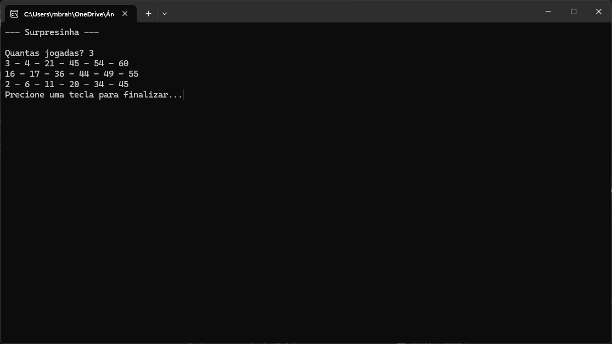

# 🎲 Exercício Surpresinha

Projeto prático desenvolvido como parte das atividades escolares PC-1 da **Etec Adolpho Berezin - 1I3**.

**Autores:**  
- Matheus Brahim Almeida  
- Guilherme Domingos  

---

## 📋 Descrição do Projeto

Este projeto simula uma jogada do tipo **"Surpresinha"** da Mega-Sena, onde os números são sorteados aleatoriamente pelo sistema, sem intervenção do usuário.

O programa:
- Solicita a quantidade de jogos a gerar.
- Sorteia **6 números únicos por jogo**.
- Garante que **não haja números repetidos** em cada jogo.
- Exibe os números **em ordem crescente**.

---

## 🚀 Manual do Usuário

1. Execute o programa.
2. Insira o número de jogos que deseja gerar.
3. Veja os resultados de cada jogada com 6 números aleatórios entre 1 e 60, organizados em ordem crescente.

---

## 🧠 Tecnologias Utilizadas

- C#
- Lógica de programação
- Git e GitHub

---

## 📸 Capitura de Tela



---

## 📁 Download do Projeto

Você pode baixar todos os arquivos deste projeto clicando no botão abaixo:

👉 [Baixar o projeto em .zip](dist/Surpresinha.zip)

Execute utilizando o comando:

```
--- dotnet Surpresinha.dll
```

---

## 🏆 Requisitos Atendidos

✅ Software funcional e fácil de usar  
✅ Código organizado e sem bugs  
✅ Boas práticas de programação  
✅ Site de divulgação claro e informativo  
✅ Melhorias visuais na apresentação

---

